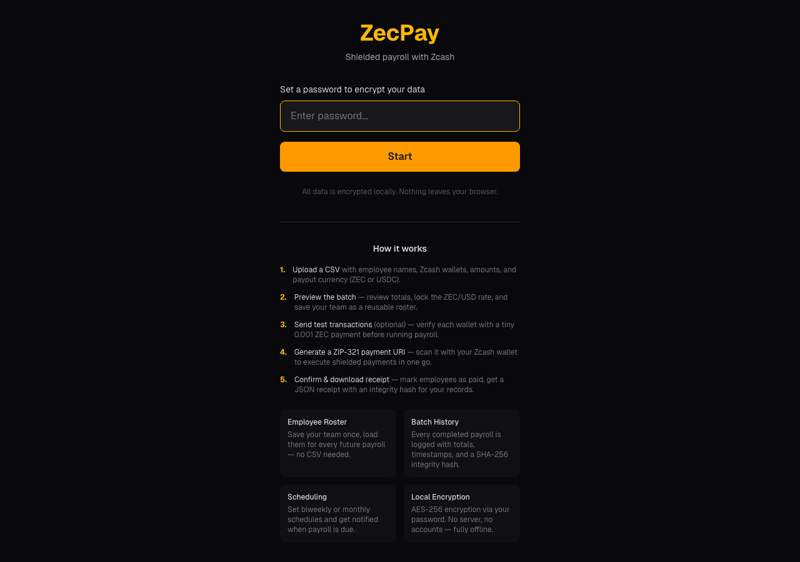

# ZecPay — Shielded Payroll with Zcash

**CSV → Preview → ZIP-321 URI → Pay with Zodl**

ZecPay is a privacy-first, client-side payroll tool that converts a CSV of employees into a single [ZIP-321](https://zips.z.cash/zip-0321) multi-payment URI. Scan the QR code or paste the URI into a Zcash wallet like [Zodl](https://zodl.xyz) to execute shielded batch payments — no server, no accounts, no data leaves your browser.

**[Live Demo →](https://zecpay-delta.vercel.app/)**



---

## Features

| Feature | Description |
|---------|-------------|
| **CSV Import** | Upload employees with name, wallet, amount, currency |
| **Employee Roster** | Save your team once, load them for every future payroll |
| **Live ZEC/USD Rate** | Fetched from CoinGecko, auto-refreshes every 5 min |
| **ZIP-321 URIs** | Spec-compliant multi-payment URIs for batch payroll |
| **QR Code** | Scannable payment URI for mobile wallets |
| **ZEC + USDC Payouts** | USDC via Zodl's NEAR Intents auto-swap |
| **Test Mode** | Verify wallets with 0.001 ZEC before running payroll |
| **Batch History** | Completed payrolls logged with totals and SHA-256 integrity hashes |
| **Downloadable Receipts** | JSON receipts with full batch details and hash verification |
| **Scheduling** | Biweekly/monthly payroll reminders with browser notifications |
| **Local Encryption** | AES-256 via NaCl + PBKDF2 password-derived keys |

## How It Works

1. **Set a password** — encrypts all data locally in your browser
2. **Upload a CSV** or load the built-in sample, or use your saved roster
3. **Preview the batch** — review employees, amounts, ZEC conversion, lock the rate
4. **Test wallets** (optional) — send 0.001 ZEC to verify each address
5. **Generate ZIP-321 URI** — scan QR with Zodl or copy the URI
6. **Confirm payments** — mark each employee as paid, download a receipt
7. **History** — every completed batch is logged with an integrity hash

## CSV Format

```csv
name,wallet,amount,currency,payout_currency
Alice,zs1abc...,500,USD,ZEC
Bob,zs1def...,0.5,ZEC,ZEC
Carol,zs1ghi...,1000,USD,USDC
```

| Column | Required | Values |
|--------|----------|--------|
| `name` | Yes | Recipient name |
| `wallet` | Yes | Zcash address (`zs`, `u1`, or `t1`) |
| `amount` | Yes | Numeric amount |
| `currency` | No | `USD` (default) or `ZEC` |
| `payout_currency` | No | `ZEC` (default) or `USDC` |

## Privacy & Security

ZecPay is designed with zero-trust principles:

- **No backend** — 100% client-side, nothing is transmitted to any server
- **No accounts** — your password derives the encryption key locally
- **AES-256 encryption** — all data (roster, batches, history) encrypted in localStorage using [TweetNaCl](https://tweetnacl.js.org/)
- **PBKDF2 key derivation** — password stretched before use as encryption key
- **Shielded addresses** — supports Sapling (`zs...`), Unified (`u1...`), and transparent (`t1...`) addresses
- **Integrity hashes** — each completed batch receipt includes a SHA-256 hash for tamper detection
- **Open source** — audit the code yourself

## What is ZIP-321?

[ZIP-321](https://zips.z.cash/zip-0321) defines a URI format for Zcash payment requests, including multi-recipient payments:

```
zcash:?address=<addr>&amount=<zec>&address.1=<addr2>&amount.1=<zec2>
```

This allows a single URI to encode a full batch payroll that a compatible wallet can execute in one go.

## Tech Stack

- **Next.js 16** — App Router, React 19
- **TypeScript** — end-to-end type safety
- **Tailwind CSS** — utility-first styling
- **TweetNaCl** — client-side encryption
- **qrcode.react** — QR code generation
- **CoinGecko API** — live ZEC/USD pricing
- **Playwright** — E2E testing
- **Vitest** — unit testing
- **Vercel** — deployment

## Development

```bash
git clone https://github.com/Spider333/zecpay.git
cd zecpay
npm install
npm run dev
```

Open [http://localhost:3000](http://localhost:3000).

## Testing

```bash
# Unit tests (68 tests)
npm test

# E2E tests (Playwright — launches Chromium)
npm run test:e2e

# E2E against production
E2E_BASE_URL=https://zecpay-delta.vercel.app npm run test:e2e
```

## Deploy

Push to GitHub and connect to Vercel, or:

```bash
npx vercel
```

## License

[MIT](LICENSE)
